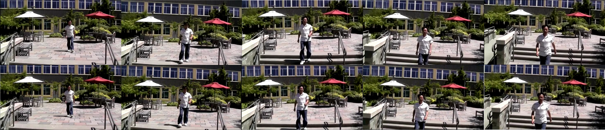

__Video Stabilization using Deep Learning based Optical Flow__ is an open source video stabilization using deep learning, developed by POSTECH computer graphics laboratory

## Requirement ##

Tensorflow 1.10

## How to run ##

set the path of stabilized video and unstabilized video in config.py file and run main_flownetS_pyramid_noprevloss_dataloader.py
For example, if you want to train, run
```
python3 main_flownetS_pyramid_noprevloss_dataloader.py --mode main_flownetS_pyramid_noprevloss_dataloader --is_train true --delete_log true
```
If you want to test, put a checkpoint file into fixed_ckpt folder and run
```
python3 main_flownetS_pyramid_noprevloss_dataloader.py --mode main_flownetS_pyramid_noprevloss_dataloader --is_train false --delete_log false
```

## Result ##
Upper images: input, lower images: output.
  

## License ##
This software is being made available under the terms in the [LICENSE](LICENSE) file.

Any exemptions to these terms requires a license from the Pohang University of Science and Technology.

## Useful Links ##

  * [POSTECH CG Lab.](http://cg.postech.ac.kr/)